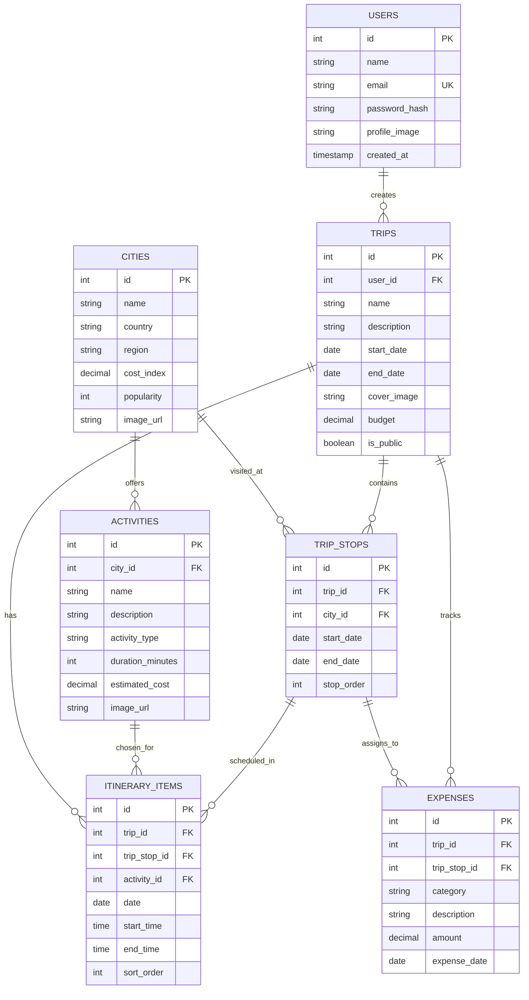

# 🌍 GlobeTrotter - Intelligent Travel Planner & Budget Tracker

GlobeTrotter is a premium, feature-rich **Full-Stack Web Application** designed for planning travel stops, managing durational schedules, and tracking budgets. Built with a robust **Django REST Framework (DRF)** backend, a highly responsive **React + Vite** frontend, and a relational **PostgreSQL** database, GlobeTrotter offers a seamless, premium user experience with real-time feedback.

---

## 🚀 Key Evaluator Highlights & Keywords
- **Full-Stack Architecture**: Monolithic API backend with a decoupled single-page application (SPA) frontend.
- **Relational PostgreSQL Schema**: Structured database with full Referential Integrity (foreign keys, check constraints, indexes, cascading deletes).
- **JWT (JSON Web Token) Security**: Custom JWT auth pipeline mapping backend session state to frontend localStorage.
- **Complex Serialization**: Custom nested serialization in Django to handle multi-level relational data (Trips ➔ Stops ➔ Itinerary Items & Expenses) in single CRUD transactions.
- **Optimized UI/UX**: Fast Vite builds, Tailwind CSS (v4), smooth transitions, dynamic budget progress bars, and rich aesthetic elements.

---

## 🛠️ Technology Stack

### Backend
- **Django** & **Django REST Framework (DRF)**: High-performance Python REST API framework.
- **PostgreSQL**: Relational database managing users, trips, stops, activities, itineraries, and expenses.
- **JWT Authentication**: Secure stateless token-based user authentication.

### Frontend
- **React 19**: Modern declarative UI framework.
- **Vite**: Ultra-fast next-generation frontend tooling with HMR (Hot Module Replacement).
- **Tailwind CSS v4**: Utility-first CSS styling for modern, fluid glassmorphism and custom color palettes.
- **React Router DOM**: Declarative client-side routing.
- **Lucide React**: Clean, modern SVG icon library.

---

## 🗄️ Database Relational Schema

The database model is defined in `GlobeTrotter.sql` and includes the following entity-relationship components:



---

## 🔌 API Endpoints Documentation

All endpoints (except Authentication and Health Check) require a Bearer token passed in the `Authorization` header: `Authorization: Bearer <your-jwt-token>`.

### 🛡️ Authentication
- `POST /api/auth/signup/` — Register a new user account.
- `POST /api/auth/login/` — Authenticate user and receive JWT.

### ✈️ Trips Management
- `GET /api/trips/` — Retrieve all planned trips for the logged-in user.
- `POST /api/trips/` — Create a new trip plan.
- `GET /api/trips/<id>/` — Retrieve complete details of a specific trip.
- `PUT /api/trips/<id>/` — Fully update a trip (including nested stops, itinerary, and expenses).
- `DELETE /api/trips/<id>/` — Delete a trip (automatically cascades down to stops/itinerary/expenses).
- `GET /api/trips/public/<id>/` — Access trip itinerary via a public share link (no auth required).

### 📍 Stops, Itineraries, and Expenses
- `GET /api/cities/` — List all registered destination cities.
- `POST /api/trips/<trip_id>/stops/` — Add a new travel stop.
- `PUT /api/trips/<trip_id>/stops/<stop_id>/` — Update stop dates or order.
- `DELETE /api/trips/<trip_id>/stops/<stop_id>/` — Delete a stop.
- `GET/POST /api/trips/<trip_id>/expenses/` — Fetch or record expenses for a trip.

---

## ⚙️ Running the Project Locally

### 1. Database Setup
Ensure PostgreSQL is running and create the database:
```sql
CREATE DATABASE GlobeTrotter;
```
Import the schema:
```bash
psql -U postgres -d GlobeTrotter -f GlobeTrotter.sql
```

### 2. Backend Setup
Navigate to the `backend` folder:
```bash
cd backend
```
Create a virtual environment & install requirements:
```bash
python -m venv .venv
source .venv/bin/activate  # On Windows: .venv\Scripts\activate
pip install -r requirements.txt
```
Create a `.env` file with your credentials:
```env
DB_NAME=GlobeTrotter
DB_USER=postgres
DB_PASSWORD=yourpassword
DB_HOST=localhost
DB_PORT=5432
SECRET_KEY=your_jwt_secret_key
DEBUG=True
```
Start the Django server:
```bash
python manage.py runserver
```

### 3. Frontend Setup
Navigate to the `frontend` folder:
```bash
cd ../frontend
```
Install dependencies & run Vite dev server:
```bash
npm install
npm run dev
```

The application will be available at: **`http://localhost:5173`**
